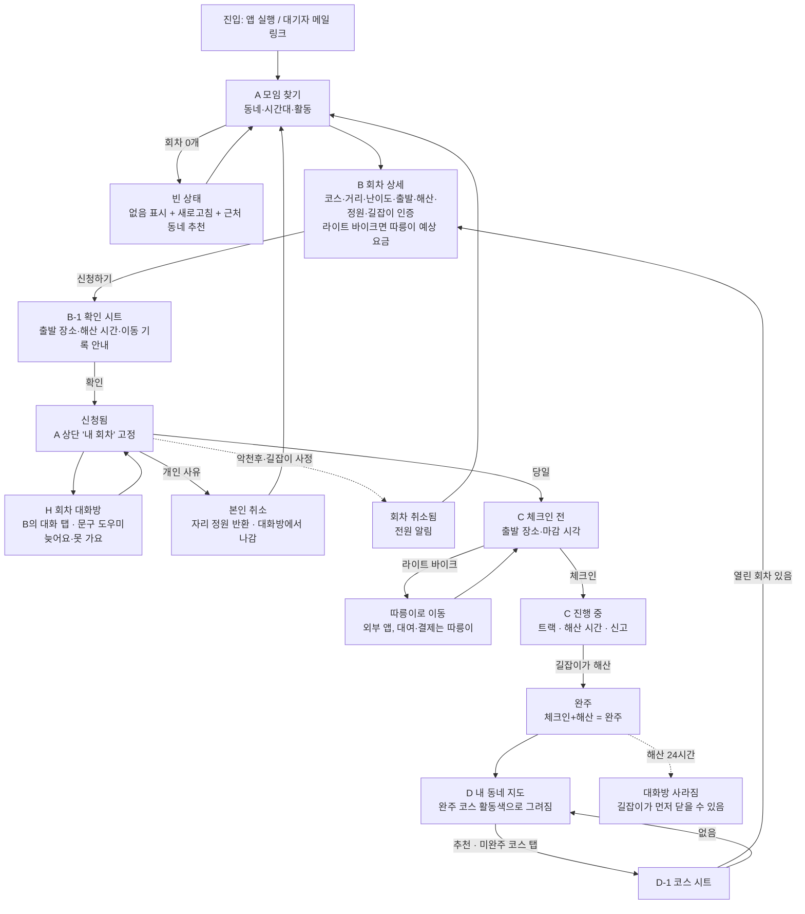

# 동행자 플로우 — 찾기 → 신청 → (대화) → 체크인 → 해산 → 지도 · v1.2 (MANUAL v1.6 반영, 2026-09-29)

근거: SC-1 · SC-2 · ia.md v1.2 · D-M3-01~08 · MANUAL v1.6 F-11·F-12·F-13. 화면 ID는 ia.md.
v1.2: 회차 대화방(H) · 러닝 · 완주 코스 활동색·그려지는 연출 · 지도 추천 · 문구 압축

## 단계표

| # | 화면 | 사용자 행동 | 시스템 응답·상태 | 되돌아가기 | 참조 |
|---|---|---|---|---|---|
| 1 | 진입 → A | 앱을 연다(가입 없음). 메일 링크면 동네가 미리 잡힘 | 동네=대기자 신청 동네 또는 위치 권한 → 구 단위. 권한 거부 시 수동 선택 | — | F-01 · F-03 |
| 2 | A | 활동 칩 한 줄(전체·산책·조깅·러닝·라이트 바이크) + 상단 날짜 스트립(오는 7일, "9/30 (수)")에서 하루 고름. 기본은 7일 전체를 날짜별로 묶어 표시 | 카드마다 "9/30 (수) 19:00 → 19:30" · 거리 · "예상 완주 시간 N분" · "3/6명 신청 중". 0개면 빈 상태: 없음 표시 + 당겨서 새로고침 + 근처 동네 회차 추천 | 탭 | F-01 · D-M3-01 · D-M3-07 |
| 3 | A → B | 카드 탭 | 회차 상세. 취소 기준(악천후 시 언제 알림)도 여기 | 뒤로 | F-02 · H-20 |
| 4 | B | 정보 읽기. 라이트 바이크면 **따릉이 예상 요금**(이용권 없음 → 1시간권 기준 / 있음 → 0) | 요금은 "예상" 표기 + 출처. 보조 버튼 "따릉이로 이동"은 신청 뒤 활성 | 뒤로 | F-09 · R-07 |
| 5 | B → B-1 | 주 버튼 "신청하기" | 확인 시트: 출발 장소·해산 시간·"이동 기록은 체크인~해산에만, 나만 보기"·"신청하면 회차 대화방에 들어가요" | 닫기 | F-03 · F-05 · F-11 |
| 6 | B-1 → B | 확인 | 신청됨 배지 + **"내 캘린더에 추가"**(기기 캘린더 .ics: 회차명·출발→해산·출발 지점·코스, 알림 1시간 전). 주 버튼 → "신청 취소"(보조 스타일), A 상단에 그날 회차 고정 | — | F-03 · D-M3-08 |
| 6b | B → H | 대화 탭 | 처음 들어가면 입장 안내(해산 24시간 뒤 사라짐 · 신고된 메시지만 확인을 위해 남김 · 연락처 교환은 각자 판단). 문구 도우미 "조금 늦어요" "못 가게 됐어요" "출발 장소 도착했어요" + 자유 입력(500자). 길잡이 메시지는 "길잡이" 배지 | 정보 탭 | F-11 · 원칙 3 |
| 7a | B | (개인 사유) 신청 취소 — 출발 전까지 언제든, 마감 없음 | 확인 문구에 회차 이름 포함 → 취소됨(본인), 자리 즉시 재개방, **대화방에서 나감**(남은 사람에게 "○○님이 신청을 취소했어요"). 기기 캘린더는 직접 삭제 안내 | A | F-03 · R-06 · D-M3-04 · D-M3-08 |
| 7b | 알림 → A | (악천후·길잡이 사정·길잡이 미도착 +15분) 회차 취소 알림 | 목록에 "취소됨" 배지로 남음, 같은 활동 다른 회차 안내, "캘린더에서 삭제" 안내 | — | F-03 · D-M3-04 · D-M3-08 |
| 8 | A → C | 당일, 상단 고정 회차("9/30 (화) 19:30") 탭 | C 체크인 전: 출발 장소·시각·체크인 마감 시각, 체크인 버튼 | 뒤로 | F-04 · D-M3-07 |
| 9 | C → 따릉이 | (라이트 바이크) "따릉이로 이동" | 따릉이 앱 열림. 대여·결제는 따릉이(범위 밖). 돌아오면 C 그대로 | — | F-09 |
| 10 | C | 체크인 | 체크인됨 + 이동 기록 시작(위치 권한 없으면 기록만 꺼짐). 누가 길잡이인지는 대면에서 확인 | — | F-04 · F-05 · D-M3-02 |
| 11 | C 진행 중 | 걷는다. 화면은 트랙(퍼센트 없음)·해산 시간·신고 아이콘 | 오프라인이어도 상태 유지, 연결 시 반영 | 신고 → F | F-04 · F-08 |
| 12 | C → 완주 | 길잡이가 해산 | 기록 종료, **체크인+해산 = 완주**. 완주 화면 → D로 이어짐. 대화방은 해산 24시간 뒤 사라진다는 안내(길잡이가 먼저 닫을 수 있음) | — | F-04 · D-M3-02 · F-11 |
| 13 | D | 지도를 열면 완주 코스가 최근 순으로 활동색으로 그려짐(세션당 1회), 미완주는 점선. 실지형(한강·공원·도로) 위, 코스 범위에 맞춰 보임 | 순위·비교·스트릭 없음 | 탭 | F-06 · N-05 · 원칙 2 |
| 13b | D | 상단 "다음 코스" 추천 최대 3개(열린 회차가 있는 미완주 코스) | 누르면 D-1 | — | F-13 |
| 14 | D → D-1 → B | 미완주 코스 탭 → 열린 회차 있으면 B | 없으면 코스 정보만("아직 열린 모임이 없어요") | 닫기 | D-M3-03 · F-01 |

## 상태 전이 (회차 × 동행자)

`목록 → 신청됨(대화방 입장) → (본인 취소됨(대화방 나감) | 회차 취소됨 | 체크인됨 → 완주)`. 대화방: `열림 → 해산 → (길잡이가 닫음 | 24시간 뒤 사라짐)`. 신청됨에서 체크인 마감 시각까지 체크인이 없으면 "불참"으로만 남고 페널티·이력 노출 없음(NG-02, R-06). 회차 취소됨의 원인 3: 악천후 · 길잡이 사정 · 길잡이 미도착(+15분 자동).

## 빈칸 처리 (v1.1)
- 7a 본인 취소 마감 없음 (D-M3-04) · 7b 취소 원인 3종·미도착 자동 취소 (D-M3-04) · 2 날짜 스트립·정확한 요일 표기 (D-M3-07) · 6 캘린더 플랜 (D-M3-08)
- 남은 임시값: 4 따릉이 요금 표시 강도(현재: 예상 요금 + 이용권 안내 링크, 미검증 H-13)
